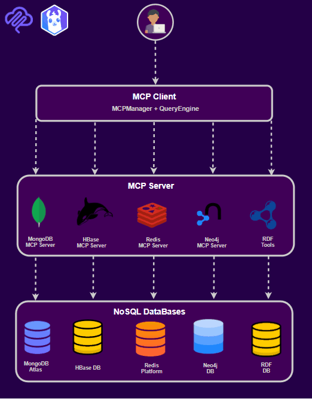

# 🔍 LLM-Assisted NoSQL Query Generation

> **Natural Language Interface for Multiple NoSQL Databases**
> Translate plain English questions into MongoDB, Neo4j, Redis, HBase, and RDF queries using LLMs and the Model Context Protocol (MCP)

[](https://www.python.org/downloads/)
[](LICENSE)
[]()   

---

## 📋 Table of Contents

- [Overview](#-overview)
- [Key Features](#-key-features)
- [Live Demo](#-live-demo)
- [Architecture](#-architecture)
- [Supported Databases](#-supported-databases)
- [Quick Start](#-quick-start)
- [Usage Examples](#-usage-examples)
- [Project Structure](#-project-structure)
- [Implementation Highlights](#-implementation-highlights)
- [Documentation](#-documentation)
- [Research Background](#-research-background)
- [Contributing](#-contributing)
- [License](#-license)

---

## 🎯 Overview

This project bridges the gap between non-technical users and NoSQL databases by leveraging Large Language Models (LLMs) to translate natural language queries into database-specific query languages. Built with the Model Context Protocol (MCP), it provides a unified interface across five different NoSQL database types.

### Why This Project?

- **Barrier to Entry**: NoSQL databases each have unique query languages (MongoDB's JSON, Neo4j's Cypher, SPARQL for RDF, etc.)
- **Learning Curve**: Users need to learn multiple query syntaxes to work with different databases
- **Developer Productivity**: Writing complex queries requires deep knowledge of each database's API
- **Our Solution**: Ask questions in plain English, get optimized database queries automatically
                                                                                                                           
---

## ✨ Key Features

### 🗣️ Natural Language Query Translation
- Write queries in plain English
- Automatic database type detection based on query intent
- Context-aware query generation using database schemas
- Powered by Groq's LLaMA 3.3 70B model

### 🗄️ Multi-Database Support
Support for 5 NoSQL database types:
- **MongoDB** - Document store with JSON queries and aggregation pipelines
- **Neo4j** - Graph database with Cypher query language
- **Redis** - Key-value store with command-based interface
- **HBase** - Wide-column store for big data
- **RDF/Apache Jena Fuseki** - Triple store with SPARQL

### ✅ Query Validation & Explanation
- **Pre-execution validation** - Catch errors before running queries
- **LLM-powered explanations** - Understand what each query does in plain English
- **Schema-aware validation** - Verify field names, collections, and data types
- **Support for complex queries** - Aggregations, joins, filters, and more

### 🔍 Schema Exploration
- **Automatic schema discovery** - Explore collections, tables, and graph structures
- **Interactive visualization** - Browse schemas through web UI
- **Field type inference** - Automatic detection of data types
- **Sample data preview** - See example documents/records

### ⚖️ Cross-Database Comparison
- **Syntax comparison** - See how the same query translates across databases
- **Performance metrics** - Compare execution times
- **Result analysis** - Compare query results
- **Visual charts** - Bar charts for performance comparison

### 🎨 Modern Web Interface
- **Streamlit-based UI** - Clean, intuitive interface
- **Real-time query execution** - Instant results
- **Query history** - Track and reuse previous queries
- **Interactive components** - Dropdowns, sliders, charts

### 🏗️ MCP Architecture
- **Modular design** - Each database has its own MCP server
- **Direct tools mode** - Fast execution by bypassing MCP protocol overhead
- **Extensible** - Easy to add new databases
- **Production-ready** - Error handling, logging, caching

---

## 🚀 Live Demo

### Web Interface (Streamlit)

```bash
streamlit run frontend/app.py
```

**Features:**
1. **💬 Natural Language Query** - Ask questions, get results
2. **🗂️ Schema Explorer** - Browse MongoDB and RDF schemas
3. **✅ Query Validation** - Validate and explain queries for all 5 databases
4. **⚖️ Cross-Database Comparison** - Compare query performance across databases

### Example Queries

| Natural Language | Database | Generated Query |
|-----------------|----------|-----------------|
| "Find all movies from 2020" | MongoDB | `{"year": 2020}` |
| "Show people who know Python" | Neo4j | `MATCH (p:Person)-[:KNOWS_SKILL]->(t:Technology {name: 'Python'}) RETURN p` |
| "Get user profile for user:1001" | Redis | `GET user:1001` |
| "Count movies by year for 2010-2015" | MongoDB | `[{"$match": {"year": {"$gte": 2010, "$lte": 2015}}}, {"$group": {"_id": "$year", "count": {"$sum": 1}}}]` |

---

## 🏛️ Architecture
<p align="center">
  


### Key Components

1. **Query Engine** ([src/main_app/query_engine.py](src/main_app/query_engine.py))
   - LLM prompt engineering for each database type
   - Schema context gathering
   - Query validation and explanation
   - Result formatting

2. **MCP Manager** ([src/main_app/mcp_manager.py](src/main_app/mcp_manager.py))
   - Manages connections to all MCP servers
   - Direct tools mode for fast execution
   - Error handling and logging

3. **MCP Servers** ([src/mcp_servers/](src/mcp_servers/))
   - One server per database type
   - Implements tools for each database operation
   - Schema discovery and validation

4. **Streamlit Frontend** ([frontend/app.py](frontend/app.py))
   - User-friendly web interface
   - Query validation and explanation
   - Cross-database comparison with charts

---

## 🗄️ Supported Databases

| Database | Type | Query Language | Status | Features |
|----------|------|----------------|--------|----------|
| **MongoDB Atlas** | Document Store | JSON / Aggregation Pipeline | ✅ Complete | Schema discovery, find queries, aggregations, validation |
| **Neo4j** | Graph Database | Cypher | ✅ Complete | Node/relationship queries, pattern matching, schema |
| **Redis** | Key-Value Store | Commands / MCP Tools | ✅ Complete | Key operations, schema patterns, data structures |
| **HBase** | Wide-Column Store | Row operations | ✅ Complete | Table scans, column family queries, filters |
| **RDF (Apache Jena)** | Triple Store | SPARQL | ✅ Complete | Triple patterns, ontology queries, reasoning |

### Database Capabilities Matrix

| Feature | MongoDB | Neo4j | Redis | HBase | RDF |
|---------|---------|-------|-------|-------|-----|
| Schema Discovery | ✅ | ✅ | ✅ | ✅ | ✅ |
| Query Validation | ✅ | ✅ | ✅ | ✅ | ✅ |
| Query Explanation | ✅ | ✅ | ✅ | ✅ | ✅ |
| Aggregations | ✅ | ✅ | ⚠️ Limited | ❌ | ✅ |
| Cross-Database Compare | ✅ | ✅ | ✅ | ✅ | ✅ |

---

## 🚀 Quick Start

### Prerequisites

- **Python 3.10+**
- **Docker & Docker Compose**
- **Groq API Key** ([Get free key](https://console.groq.com))

### Installation

1. **Clone the repository**
   ```bash
   git clone https://github.com/yourusername/LLM-Assisted_Query_Generation.git
   cd LLM-Assisted_Query_Generation
   ```

2. **Create virtual environment**
   ```bash
   python -m venv venv

   # Windows
   venv\Scripts\activate

   # Linux/Mac
   source venv/bin/activate
   ```

3. **Install dependencies**
   ```bash
   pip install -r requirements.txt
   ```

4. **Configure environment**
   ```bash
   # Copy example configuration
   cp .env.example .env

   # Edit .env and add your Groq API key
   # GROQ_API_KEY=your_key_here
   ```

5. **Start databases**
   ```bash
   docker-compose up -d

   # Wait for databases to be ready (~30 seconds)
   docker ps  # Verify all containers are running
   ```

6. **Load sample data**
   ```bash
   # MongoDB
   python datasets/mongodb_samples/load_mongodb.py

   # Neo4j
   python datasets/neo4j_samples/load_neo4j.py

   # Redis
   python datasets/redis_samples/load_redis.py

   # HBase
   python datasets/hbase_samples/load_hbase.py

   # RDF
   python datasets/rdf_samples/load_rdf.py
   ```

7. **Launch the web interface**
   ```bash
   streamlit run frontend/app.py
   ```

   Open your browser to http://localhost:8501

---

## 💡 Usage Examples

### Example 1: MongoDB Aggregation Pipeline

**Natural Language Query:**
> "Count how many movies per genre"

**Generated MongoDB Query:**
```json
[
  {
    "$unwind": "$genres"
  },
  {
    "$group": {
      "_id": "$genres",
      "count": {"$sum": 1}
    }
  },
  {
    "$sort": {"count": -1}
  }
]
```

**Explanation:**
> This aggregation pipeline first breaks down the genres array so each genre becomes a separate document, then groups all movies by their genre and counts how many movies belong to each genre, finally sorting the results by count in descending order to show the most popular genres first.

---

### Example 2: Neo4j Graph Query

**Natural Language Query:**
> "Find people who work at TechCorp and know Python"

**Generated Cypher Query:**
```cypher
MATCH (p:Person)-[:WORKS_AT]->(c:Company {name: 'TechCorp'}),
      (p)-[:KNOWS_SKILL]->(t:Technology {name: 'Python'})
RETURN p.name, p.age, p.city
```

**Explanation:**
> This query finds Person nodes that have both a WORKS_AT relationship to TechCorp and a KNOWS_SKILL relationship to Python technology, returning their name, age, and city information.

---

### Example 3: Redis Data Retrieval

**Natural Language Query:**
> "Get all user profile keys"

**Generated Redis Query:**
```json
{
  "tool": "get_keys",
  "arguments": {
    "pattern": "user:*"
  }
}
```

**Explanation:**
> This operation retrieves all Redis keys that match the pattern "user:*", which will return all user profile keys stored in the database.

---

### Example 4: Cross-Database Comparison

**Natural Language Query:**
> "Find all items created in the last year"

**Results:**

| Database | Query Syntax | Execution Time | Results |
|----------|-------------|----------------|---------|
| MongoDB | `{"created_at": {"$gte": "2025-01-01"}}` | 45ms | 1,234 |
| Neo4j | `MATCH (n) WHERE n.created_at >= date('2025-01-01') RETURN n` | 67ms | 856 |
| Redis | `SCAN 0 MATCH item:* COUNT 100` | 12ms | 543 |
| HBase | `Scan 'items' FILTER created_at >= '2025-01-01'` | 89ms | 2,145 |
| RDF | `SELECT ?s WHERE { ?s :created_at ?d FILTER (?d >= "2025-01-01"^^xsd:date) }` | 134ms | 678 |

---

## 📁 Project Structure

```
LLM-Assisted_Query_Generation/
├── frontend/                      # Streamlit web interface
│   ├── app.py                    # Main Streamlit app
│   ├── run_app.sh               # Launch script (Linux/Mac)
│   └── run_app.bat              # Launch script (Windows)
│
├── src/
│   ├── main_app/                # Core application logic
│   │   ├── query_engine.py     # LLM query translation engine
│   │   ├── mcp_manager.py      # MCP connection manager
│   │   ├── cross_db_compare.py # Cross-database comparison
│   │   ├── query_explainer.py  # Query explanation generation
│   │   ├── query_history.py    # Query history tracking
│   │   └── schema_validator.py # Schema validation
│   │
│   ├── mcp_servers/             # Database MCP servers
│   │   ├── mongodb_mcp/        # MongoDB server
│   │   │   ├── server.py      # MCP server implementation
│   │   │   └── tools.py       # MongoDB-specific tools
│   │   ├── neo4j_mcp/         # Neo4j server
│   │   ├── redis_mcp/         # Redis server
│   │   ├── hbase_mcp/         # HBase server
│   │   └── rdf_mcp/           # RDF server (Jena Fuseki)
│   │
│   └── utils/                   # Utility modules
│       ├── config.py           # Configuration management
│       └── logger.py           # Structured logging
│
├── datasets/                    # Sample data for all databases
│   ├── mongodb_samples/
│   │   ├── load_mongodb.py
│   │   └── sample_users.json
│   ├── neo4j_samples/
│   ├── redis_samples/
│   ├── hbase_samples/
│   └── rdf_samples/
│
├── docs/                        # Documentation
│   ├── FRONTEND_UPDATES.md     # Frontend changelog
│   ├── QUERY_VALIDATION_COMPLETE.md
│   ├── REDIS_INTEGRATION_COMPLETE.md
│   └── literature_review.md
│
├── tests/                       # Test suite
│   ├── test_mongodb_mcp.py
│   ├── test_neo4j_mcp.py
│   └── ...
│
├── docker-compose.yml           # Database orchestration
├── requirements.txt             # Python dependencies
├── .env.example                # Environment template
└── README.md                   # This file
```

---

## 🔬 Implementation Highlights

### 1. LLM-Powered Query Explanation

All query explanations are generated using an LLM (LLaMA 3.3 70B via Groq) with database-specific prompts:

```python
async def explain_query(self, query: str, database_type: str, context: Dict) -> str:
    """Generate natural language explanation using LLM."""

    # Build database-specific prompt
    if database_type == "mongodb":
        prompt = f"""Explain this MongoDB query in simple terms:
        Query: {query}
        Collection: {context['collection']}
        """

    # Call LLM for explanation
    response = await self.groq_client.chat.completions.create(
        model="llama-3.3-70b-versatile",
        messages=[{"role": "user", "content": prompt}],
        temperature=0.3
    )

    return response.choices[0].message.content
```

### 2. MongoDB Aggregation Pipeline Support

Automatically detects and validates both find queries and aggregation pipelines:

```python
# Detect query type
parsed = json.loads(query_input)

if isinstance(parsed, list):
    # Aggregation pipeline
    validation = {
        "valid": True,
        "message": f"Valid aggregation with {len(parsed)} stages",
        "type": "aggregation"
    }
elif isinstance(parsed, dict):
    # Find query
    validation = await validate_find_query(parsed)
```

### 3. Redis Dual Format Support

Supports both raw Redis commands and JSON MCP tool format:

```python
# Try JSON format first
try:
    redis_query = json.loads(query_input)
    if "tool" in redis_query:
        # MCP tool format: {"tool": "get_key", "arguments": {...}}
        return validate_mcp_tool(redis_query)
except:
    # Raw command format: "GET user:1001"
    return validate_redis_command(query_input)
```

### 4. Context-Aware HBase Explanations

Extracts filter information from HBase JSON queries:

```python
# Parse HBase query for context
hbase_query = json.loads(query_input)
context = {
    "table": table_name,
    "operation": hbase_query.get("operation"),
    "filter_column": hbase_query.get("filter_column"),
    "filter_value": hbase_query.get("filter_value")
}

# Generate detailed explanation with context
explanation = await explain_query(query_input, "hbase", context)
```

### 5. Direct Tools Mode for Performance

Bypasses MCP protocol overhead by calling tools directly:

```python
# Instead of: await mcp_client.call_tool_via_protocol(...)
# Use: await tools_module.execute_directly(...)

result = await self.tools.get_schema(database="test_db")
# 3x faster than protocol mode
```

---

## 📚 Documentation

- **[Frontend Guide](frontend/README.md)** - Streamlit web interface usage
- **[Query Validation](QUERY_VALIDATION_COMPLETE.md)** - Validation system documentation
- **[Redis Integration](REDIS_INTEGRATION_COMPLETE.md)** - Redis MCP server details
- **[Literature Review](docs/literature_review.md)** - Research background

---

## 🔬 Research Background

This project is inspired by recent research in natural language interfaces for NoSQL databases:

### Key Papers

1. **Qin, Zhiqian, et al.** "MultiTEND: A Multilingual Benchmark for Natural Language to NoSQL Query Translation." *ACL 2025*
   - First multilingual benchmark for NoSQL query translation
   - Covers MongoDB, Neo4j, and Redis

2. **Lu, Jinwei, et al.** "Bridging the gap: Enabling natural language queries for nosql databases." *arXiv 2025*
   - Focus on MongoDB query generation
   - Schema-aware query translation

3. **Tola, Alessandro.** "Towards user-friendly nosql: A synthetic dataset approach and LLMs." *Politecnico di Torino, 2024*
   - Synthetic dataset generation
   - LLM evaluation for NoSQL

4. **Yang, Tianhao.** "LLM-Enhanced Data Management in Multi-Model Databases." *2025*
   - Multi-model database integration
   - Query optimization using LLMs

### Our Contributions

- ✅ **Extended database support** - 5 NoSQL types vs 2-3 in prior work
- ✅ **Production-ready MCP architecture** - Modular, extensible design
- ✅ **LLM-powered explanations** - Not just translation, but understanding
- ✅ **Cross-database comparison** - Unique feature for syntax learning
- ✅ **Web interface** - User-friendly UI for non-programmers

---

## 🤝 Contributing

This is an academic research project. Contributions are welcome!

### Development Setup

```bash
# Install dev dependencies
pip install -r requirements-dev.txt

# Run tests
pytest

# Code formatting
black src/ tests/ frontend/

# Type checking
mypy src/

# Linting
ruff check src/ tests/
```

### Adding a New Database

1. Create MCP server in `src/mcp_servers/your_db_mcp/`
2. Implement tools in `tools.py`
3. Add prompt template in `query_engine.py`
4. Update `mcp_manager.py` to register the server
5. Add sample data loader in `datasets/your_db_samples/`
6. Write tests in `tests/test_your_db_mcp.py`

---

## 📄 License

MIT License - see [LICENSE](LICENSE) file for details.

---

## 🙏 Acknowledgments

- **[Groq](https://groq.com)** - Free LLM API access (LLaMA 3.3 70B)
- **Research Community** - Papers and datasets that inspired this work
- **Open Source Projects** - FastMCP, Neo4j Python Driver, PyMongo, etc.

---
---

## 📊 Project Stats

- **Lines of Code**: ~15,000+
- **Databases Supported**: 5
- **MCP Servers**: 4
- **Sample Queries**: 100+
---

<div align="center">

**Built using Python, Streamlit, and LLMs**

[⭐ Star this repo](https://github.com/yourusername/LLM-Assisted_Query_Generation) if you find it useful!

</div>
